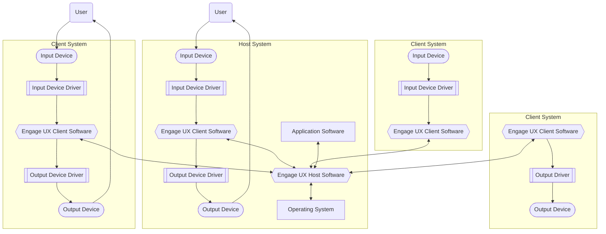

# Engage UX

[Engage UX is copyright &copy; 2025 JEleniel and released under the GNU General Public License 3.0 (or later)](LICENSE.md)

## About

Engage UX is an application UI (a.k.a. window) and input/output manager. It is designed around the User eXperience (UX) first, and flexibility and extendability second.

## Supported Operating Systems

| Linux | Windows | MacOS | Android | iOS |
| :---: | :-----: | :---: | :-----: | :-: |
|   ✔   |    ✔    |   ✔   |    ✔    |  ✔  |

## Features

- Secure by Design + All connections between the Clients and Host (including local) are encrypted using TLS 1.3 + Supports both Operating System and administrator provided Certificate Authority certificates + All client connections are authenticated, authorized, and auditable through the Operating System + Neither the Host nor the Client record anything from the applications or OS + Supports rendering the UI on the Host system, eliminating the need for separate tools such as VNC or RDP
- Uses D-Bus as the message bus system and for Inter-Process Communication (IPC)
- Fully themable output (within device capabilities) + Control the color of every element + Full support for CSS + Support for precise scaling of output to ensure physically accurate measurements

## Design

Engage UX works by abstracting input and output devices across multiple Client Systems and presenting them all to the Host System as though they were local. This allows multiple users, input devices, output devices, and systems to act as a single unit.

Engage UX provides three components that make this possible:

- Engage UX Host Software: The code that runs on the Host System, manages the UX of the applications, and manages client connections
- Engage UX Client Software: The code running on Client Systems that interfaces with input and output devices through Device Drivers, communicates with the Host System, and renders the UX
- Device Drivers: Code that implements the Engage UX Driver ABI and communicates between Engage UX and input or output devices

## Getting started

## Contributing

[Contributing to the Project](CONTRIBUTING.md)

### How to Build

## Security and Supporty

[Getting Support](SUPPORT.md)

[Reporting Security Issues](SECURITY.md)
