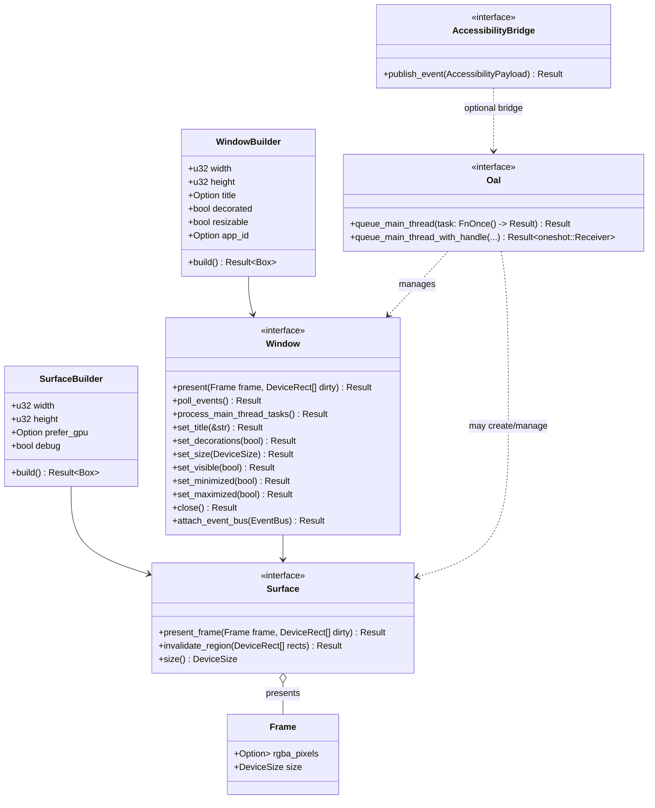

# OS Abstraction Layer (OAL) — Design Draft

This document describes a proposed OS Abstraction Layer (OAL) for the Engage UX project. Goals and hard requirements:

- Provide a minimal, stable Rust API surface for platform services needed by the UI core.
- Allow the UI core to be platform-agnostic and pure-Rust; platform crates implement the OAL traits.
- Enable optional hosting of native controls where feasible, while providing a consistent fallback renderer.
- Support native platforms only (Linux: X11 & Wayland, Windows 10+, macOS, iOS, Android). WebAssembly/WASM is out-of-scope.
- The embedding application provides the primary event loop on the main thread. The OAL must expose a clear, thread-safe mechanism for queuing and executing main-thread-only work; all other work (UI layout, render preparation, non-UI tasks) should execute on background threads.
- Renderers and surfaces MUST prefer GPU acceleration when available, with a safe, deterministic software rasterization fallback path so platforms without GPU support still function correctly.

## High-level choices and rationale

## Public API — Class diagram (Mermaid)

The diagram below shows the primary public types and traits exposed by the
`engage-ux-oal` crate's `traits` module and their high-level relationships.

-- Do not depend on upstream windowing libraries such as `winit` (or similar) inside platform crates — this project intentionally implements its own minimal windowing/event plumbing because such libraries do not satisfy the project's cross-platform or threading model requirements.

- The Geometry module contains primitive geometric types, as well as a bounding box model. The bounding box of an element includes both the margin and padding.

## Contract (small)

- Inputs: platform events (mouse, keyboard, touch, IME, clipboard, window-resize/scale), platform resources (font families, theme metrics), and raw native handles when available.
- Outputs: immediate-mode render frames (draw commands, or a GPU swap), delivered to a platform surface; synthetic accessibility tree events forwarded to OS accessibility APIs.
- Error modes: methods should return small, explicit errors (PlatformNotSupported, WrongThread, ResourceUnavailable, InvalidHandle) rather than panicking.

## Rust API guidance and idiomatic patterns

When translating this design into real Rust traits and types for the `engage-ux-oal` crate, prefer idiomatic, ergonomic, and testable APIs. These recommendations are intended to reduce footguns for implementers and make platform crates easier to write and maintain.

- Error handling
    + Use a single `OalError` enum (derive `thiserror::Error`) as the unified error type for OAL APIs. Keep variants small and descriptive (for example `PlatformNotSupported`, `WrongThread`, `ResourceUnavailable`, `InvalidHandle`, `UnsupportedOperation`). Return `Result<T, OalError>` from fallible functions.

- Ownership and concurrency
    + Prefer borrowing over ownership where possible, and use the functional model (Return<T, Error>) rather than exposing `&mut` handles widely.
    + Use `Arc<T>` for shared ownership of heavyweight resources that must outlive the calling frame or be shared across threads.
    + Document thread affinity for each method: whether it must be called on the main/UI thread or is thread-safe.

- Builders for complex configuration
    + Use the builder pattern for complex objects or configuration (for example `SkiaContextBuilder`, `SurfaceBuilder`, `WindowBuilder`). Builders should be `#[derive(Default)]` where reasonable and expose a `build(self) -> Result<...>` consuming method.
    + Keep constructors ergonomic: `let ctx = SkiaContextBuilder::builder().with_gpu(...).with_debug(true).build()?;` This makes per-platform variations easier to express without exploding constructor overloads.

- API shapes & ergonomics
    + Use `impl Trait` in return position for concrete, non-exposed types where helpful (for example `fn accessibility_bridge(&self) -> Option<Arc<dyn AccessibilityBridge>>`).
    + Prefer small, focused traits with a few methods each. It's better to compose traits than create a very large monolithic trait.
    + Use `Cow<'_, str>` or `&str` for string inputs when you don't need ownership; use `Path`/`PathBuf` for filesystem paths.

- Feature flags and crate layout
    + Use Cargo features to gate heavyweight native deps like `skia-safe`. Provide a `default` feature set that is lightweight and allow opt-in for `skia` or `skia-gpu` to keep CI/dev fast.

-- Testing and integration
    + Prioritize a clean, well-documented implementation of the Surface and backend engines. Unit-level mock crates are not a design priority here; instead prefer small integration-style tests that exercise both GPU and software surface paths and validate deterministic fallback behavior and thread-affinity contracts.

These idioms should be reflected in the trait and type definitions you add to `engage-ux-oal` and in the example platform crates.

## Threading

The embedding application provides the primary event loop and is responsible for calling into the OAL to process platform events, present frames, and run any main-thread-only work. The OAL must document which APIs require main-thread invocation and which are thread-safe.

Background threads should perform heavy work (layout, render command generation, resource loading). The OAL and UX core must avoid blocking the main loop; instead, background work should enqueue results/events and return promptly.

### Main-thread task execution

To support operations that strictly require the main thread (for example, native accessibility bridge calls or platform-specific UI APIs), the OAL MUST provide a small, explicit task-queue API:

- queue_main_thread(task): a thread-safe, non-blocking way to submit a closure or task from any background thread.
- process_main_thread_tasks(&self): a function the embedding application MUST call from the main thread (typically as part of the primary loop or render callback) to execute pending main-thread tasks. The implementation should document whether it executes all tasks or a bounded number per call.

Contract guarantees:

- queue_main_thread is safe to call from any thread and does not block the caller.
- process_main_thread_tasks runs submitted closures on the calling thread and returns promptly; it is the embedding application's responsibility to call it frequently enough for responsiveness.

### Cross-thread coordination and signaling

For coordination that crosses thread boundaries (worker runtime ⇄ platform main thread), prefer Tokio-native synchronization primitives and signaling patterns to ensure correctness and avoid races. Use explicit, small synchronization points (for example, MPMC/MPSC queues, oneshot channels, or tokio::sync primitives) and document expected ordering and error modes.

## Minimizing redraws and updating changed regions (dirty-region strategy)

To keep CPU/GPU work minimal and reduce power and latency, the OAL and UX core should support partial invalidation and local redraws rather than redrawing the entire window on every change. Implementations MUST ensure the software rasterization fallback honors the same dirty-region semantics as the GPU path so behavior and performance characteristics are consistent across configurations.
