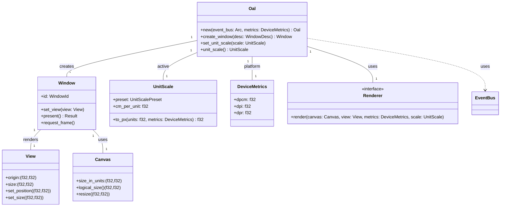

# OS Abstraction Layer (OAL) — Public API & Design

## Overview

The OAL provides a simple, ergonomic API for controlling application rendering and input event delivery. It accepts an EventBus for surfacing input events, and exposes a logical Canvas for drawing, with layout in terms of Units (U). Rendering runs on the main thread (per OS requirements); all other logic runs off-main-thread and communicates via the EventBus.

### Platform details

See:

- [Platforms API Design](backends/Platforms.md)
- [Wayland Backend](backends/Wayland/wayland.md)
- [Windows Backend](backends/Windows/windows.md)
- [X11 Backend](backends/X11/x11.md)
- [MacOS Backend](backends/MacOS/macos.md)
- [iOS Backend](backends/iOS/ios.md)
- [Android Backend](backends/Android/android.md)

## API Requirements

- **EventBus integration:** OAL accepts an EventBus and uses it to surface all input events. All non-rendering logic is off-main-thread.
- **Unit system:** Layout is expressed in Units (U). By default, 1U = 1cm = ?px (using device DPCm). The Unit scale is configurable and changeable at runtime. Presets: Metric (default, 1U=1cm), Imperial (1U=1in), Point (1U=1pt=1/72in), Pixel (1U=1px, discouraged).
- **Scaling:** U→px conversion happens inside OAL as part of the rendering pipeline, using device metrics.
- **Canvas:** Exposes a logical drawing surface (Canvas) with size f32 x f32. Coordinates can be positive or negative. Origin (0,0) is top-left; positive X is right, positive Y is down.
- **View:** A View is a rectangular region of the Canvas, rendered in a Window. By default, the View is aligned to (0,0) top-left, but its position is moveable by the developer.
- **Window:** The Window presents a View onto the Canvas. Rendering is always on the main thread.

## Unit Scaling

- Metric: 1U = 1cm → px = U * DPCm
- Imperial: 1U = 1in → px = U * DPI
- Point: 1U = 1pt → px = U * (DPI / 72.0)
- Pixel: 1U = 1px → px = U

Unit scale is runtime-configurable. Changing scale takes effect on the next frame.

## Public API (Rust-style)

```rust,ignore
struct Oal;
    fn new(event_bus: Arc<EventBus>, device_metrics: DeviceMetrics) -> Result<Oal, OalError>;
    fn create_window(&self, desc: WindowDesc) -> Result<Window, OalError>;
    fn set_unit_scale(&self, scale: UnitScale);
    fn unit_scale(&self) -> UnitScale;

struct DeviceMetrics { dpcm: f32, dpi: f32, dpr: f32 }
enum UnitScalePreset { Metric, Imperial, Point, Pixel }
struct UnitScale { preset: UnitScalePreset, cm_per_unit: f32 }
    impl UnitScale { fn to_px(&self, units: f32, metrics: &DeviceMetrics) -> f32 }

struct Window { id: WindowId }
    fn set_view(&self, view: View);
    fn present(&self) -> Result<(), OalError>;
    fn request_frame(&self);

struct Canvas { size_in_units: (f32, f32) }
    fn logical_size(&self) -> (f32, f32);
    fn resize(&mut self, new_size: (f32, f32));

struct View { origin: (f32, f32), size: (f32, f32), transform: Option<Transform> }
    fn set_position(&mut self, pos: (f32, f32));
    fn set_size(&mut self, size: (f32, f32));

trait Renderer { fn render(&mut self, canvas: &Canvas, view: &View, metrics: &DeviceMetrics, scale: &UnitScale) -> Result<(), RenderError> }
```

## Mermaid Class Diagram



## Example

```rust,ignore
// Construct device metrics: dpcm (dots per centimeter), dpi (dots per inch), dpr (device pixel ratio).
let device_metrics = DeviceMetrics::new(96.0_f32, 1.0_f32); // example: 96 DPI

let oal = Oal::new(event_bus.clone(), device_metrics)?;
// The crate exposes `Unit` (Metric/Imperial/Point/Pixel/Custom) as the unit scale.
oal.set_unit_scale(Unit::Metric)?; // set to Metric (1U = 1 cm)

let mut w = oal.create_window(WindowDesc::new("Example"))?;
let canvas = Canvas { size_in_units: (100.0, 80.0) };
let view = View { origin: (0.0, 0.0), size: (100.0, 80.0), transform: None };
w.set_view(view);
// App draws to the Canvas using logical units. OAL will convert to px during render
// using the supplied `DeviceMetrics`:
// - Metric: px = units * dpcm * dpr
// - Imperial: px = units * dpi * dpr
// - Point: px = units * (dpi / 72.0) * dpr
// - Pixel: px = units * dpr
// - Custom(f): px = units * f * dpr
```
