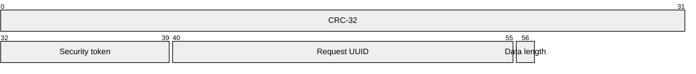
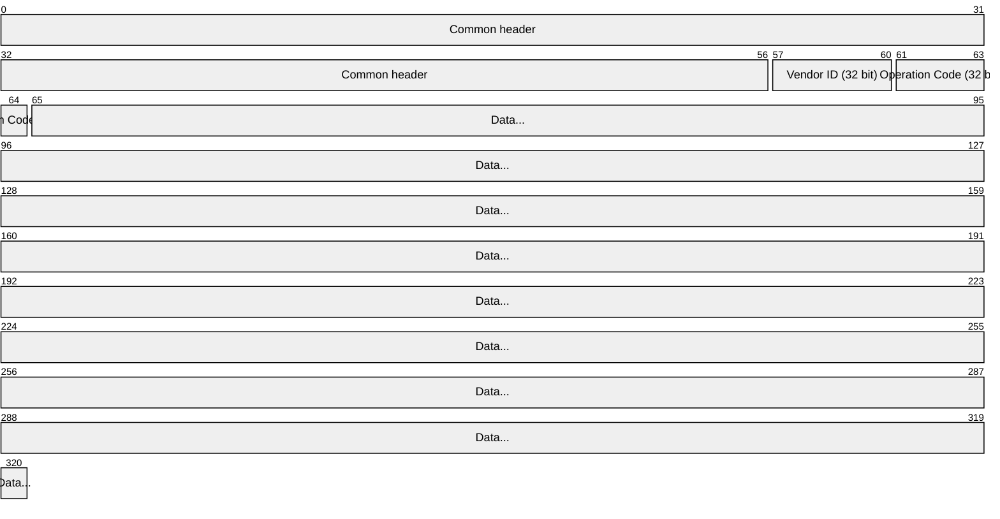
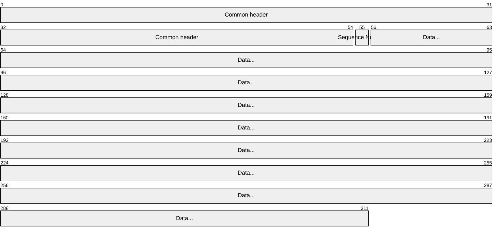

# Engage UX Network Protocol

Engage UX supports multiple connection types, including TCP/IP, Unix Sockets, XPC, AIDL, and more. No matter which connection is being used, the protocol for the data packets is identical.

## Common Header

Both the request and response start with a common 56 byte header. It is composed of:

- A CRC-32 of the remainder of the message
- The security token of the caller
- A UUID assigned by the caller to the request, and used to correlate the replies to specific requests
- A byte indicating the length of the _data_ portion of the message

## Request Format

After the common header, each request contains the following:

- A vendor specific ID indicating what extension operation code set to use. The core uses the ID zero (0x00).
- A code indicating the desired operation
- Any data required by the operation

## Reply Format

Responses contain the following after the header:

- A zero (0x00) indexed sequence number, allowing multipart responses
- The data for the indicated portion of the response

