# Component Architecture

## Overview

This document details the architecture of the component system in Engage UX, showing how the 50 UI components are organized, how they inherit common functionality, and how they interact with the core systems.

## Component Hierarchy

All components implement the `Component` trait and share common properties:

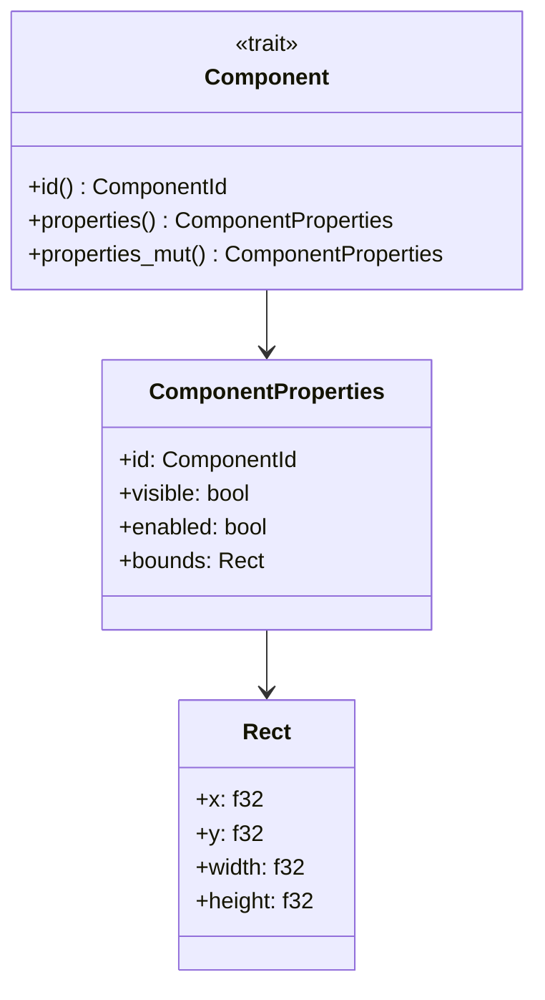

## Component Categories

The 50 components are organized into logical categories:

```mermaid
graph TB
    ROOT[Engage UX Components<br/>50 Total]
    
    INFO[Informational<br/>11 Components]
    INTER[Interactive<br/>14 Components]
    GRAPH[Graphic & Display<br/>2 Components]
    NOTIF[Notification<br/>3 Components]
    MENU[Menus<br/>4 Components]
    WIN[Window Controls<br/>3 Components]
    PANE[Pane Groups<br/>2 Components]
    DIALOG[Dialogs<br/>5 Components]
    LAYOUT[Layout/Grouping<br/>4 Components]
    
    ROOT --> INFO
    ROOT --> INTER
    ROOT --> GRAPH
    ROOT --> NOTIF
    ROOT --> MENU
    ROOT --> WIN
    ROOT --> PANE
    ROOT --> DIALOG
    ROOT --> LAYOUT
    
    INFO --> I1[Label]
    INFO --> I2[Text]
    INFO --> I3[Icon]
    INFO --> I4[Image]
    INFO --> I5[List]
    INFO --> I6[Progress]
    INFO --> I7[Tooltip]
    INFO --> I8[Breadcrumb]
    INFO --> I9[Avatar]
    INFO --> I10[Line Numbers]
    INFO --> I11[Ruler]
    
    INTER --> IN1[Button]
    INTER --> IN2[Checkbox]
    INTER --> IN3[Radio]
    INTER --> IN4[Slider]
    INTER --> IN5[Text Input]
    INTER --> IN6[Text Area]
    INTER --> IN7[Toggle]
    INTER --> IN8[Select]
    INTER --> IN9[Link]
    INTER --> IN10[Pagination]
    INTER --> IN11[Carousel]
    INTER --> IN12[Date Picker]
    INTER --> IN13[Text Editor]
    INTER --> IN14[Console]
    
    style ROOT fill:#e1f5fe
    style INFO fill:#b3e5fc
    style INTER fill:#81d4fa
    style GRAPH fill:#4fc3f7
    style NOTIF fill:#29b6f6
    style MENU fill:#03a9f4
    style WIN fill:#03a9f4
    style PANE fill:#03a9f4
    style DIALOG fill:#03a9f4
    style LAYOUT fill:#03a9f4
```

## Informational Components Detail

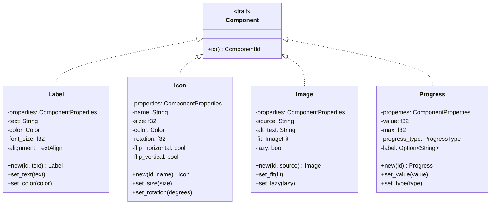

## Interactive Components Detail

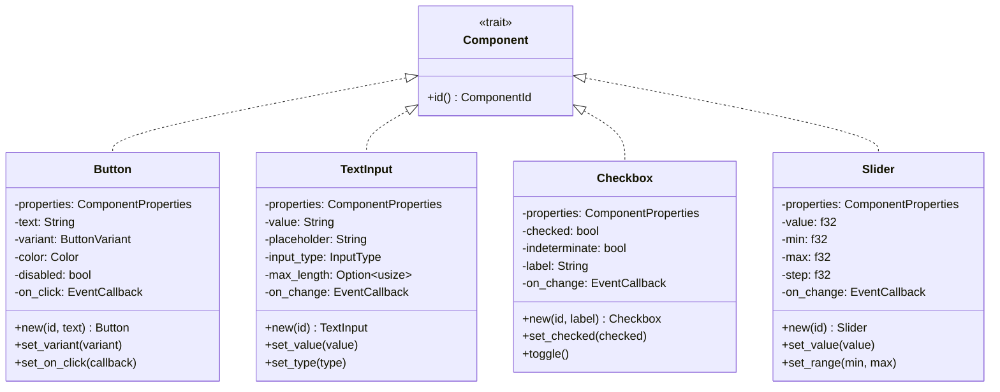

## Dialog Components Detail

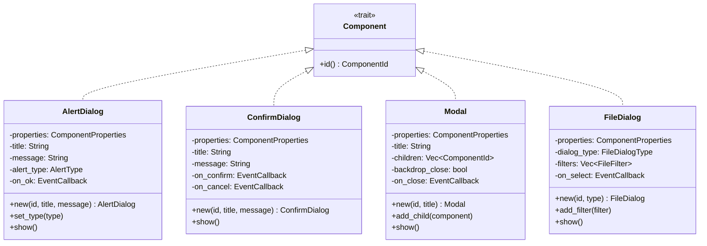

## Layout Components Detail

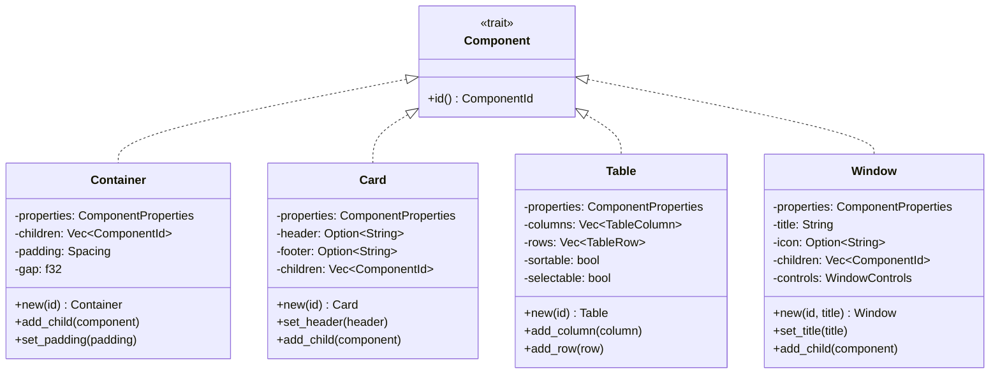

## Component State Management

Each component manages its own state:

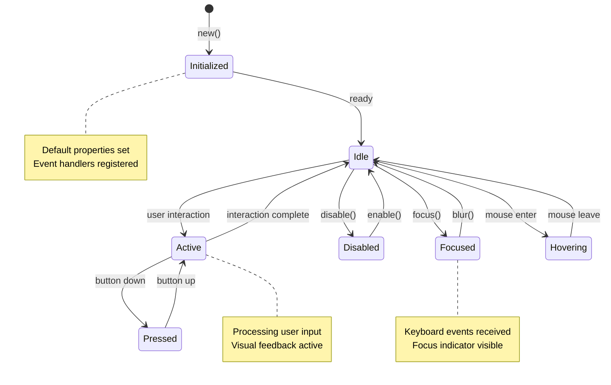

## Component Communication Patterns

### 1. Parent-Child Communication

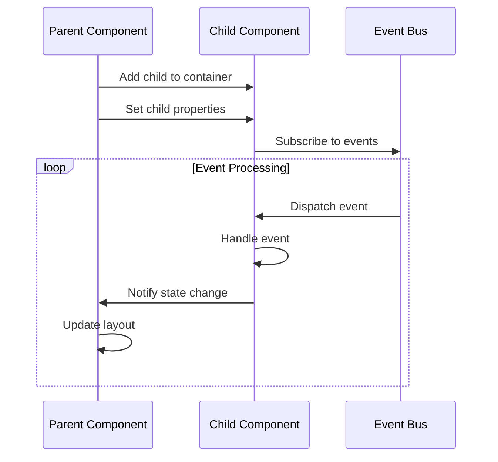

### 2. Sibling Communication

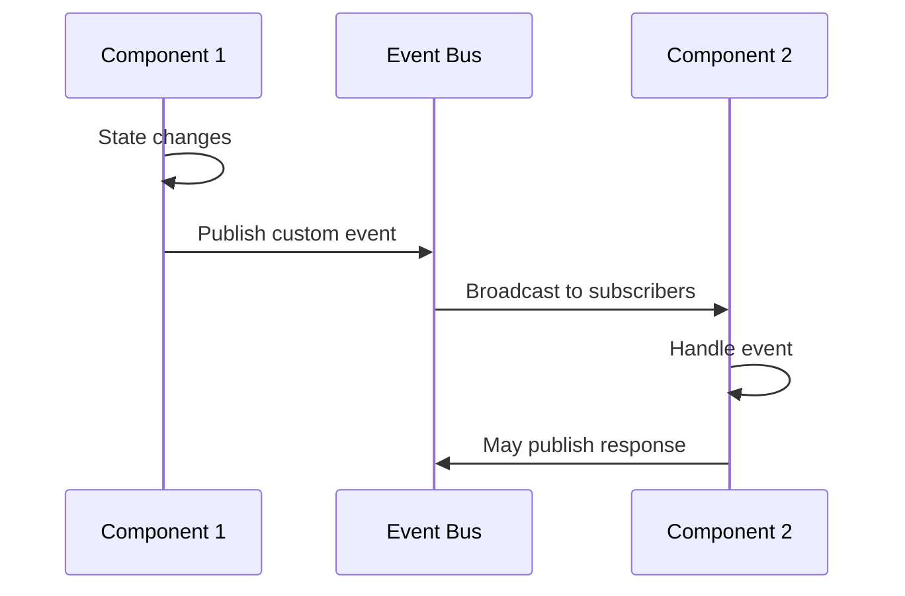

### 3. Component-to-Application Communication

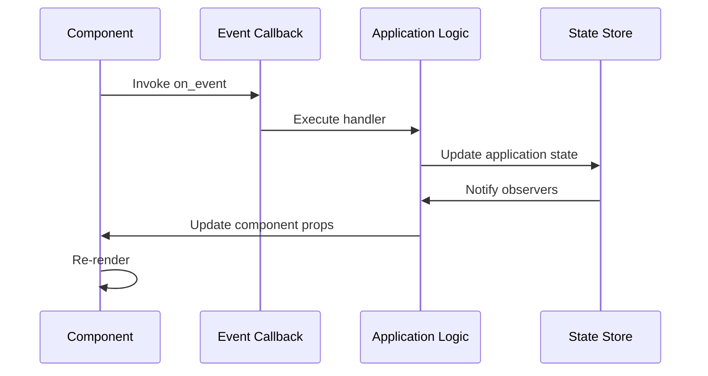

## Component Event Handling

Components can handle various event types:

```mermaid
graph TB
    COMP[Component]
    
    subgraph "Input Events"
        CLICK[Click]
        DBLCLICK[Double Click]
        KEYDOWN[Key Down]
        KEYUP[Key Up]
        MOUSEMOVE[Mouse Move]
        MOUSEENTER[Mouse Enter]
        MOUSELEAVE[Mouse Leave]
        WHEEL[Mouse Wheel]
        TOUCHSTART[Touch Start]
        TOUCHMOVE[Touch Move]
        TOUCHEND[Touch End]
    end
    
    subgraph "Focus Events"
        FOCUS[Focus Gained]
        BLUR[Focus Lost]
    end
    
    subgraph "State Events"
        CHANGE[Value Changed]
        SELECT[Selection Changed]
        TOGGLE[Toggle]
    end
    
    subgraph "Custom Events"
        CUSTOM[Custom Event]
    end
    
    CLICK --> COMP
    DBLCLICK --> COMP
    KEYDOWN --> COMP
    KEYUP --> COMP
    MOUSEMOVE --> COMP
    MOUSEENTER --> COMP
    MOUSELEAVE --> COMP
    WHEEL --> COMP
    TOUCHSTART --> COMP
    TOUCHMOVE --> COMP
    TOUCHEND --> COMP
    
    FOCUS --> COMP
    BLUR --> COMP
    
    CHANGE --> COMP
    SELECT --> COMP
    TOGGLE --> COMP
    
    CUSTOM --> COMP
    
    style COMP fill:#4caf50
    style CLICK fill:#81c784
    style FOCUS fill:#aed581
    style CHANGE fill:#c5e1a5
    style CUSTOM fill:#dcedc8
```

## Component Rendering Pipeline

Each component follows a rendering pipeline:

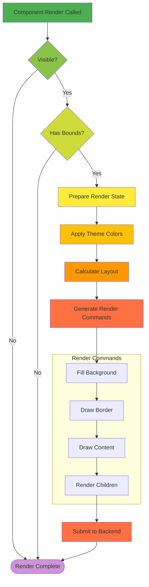

## Component Theming Integration

Components integrate with the theme system:

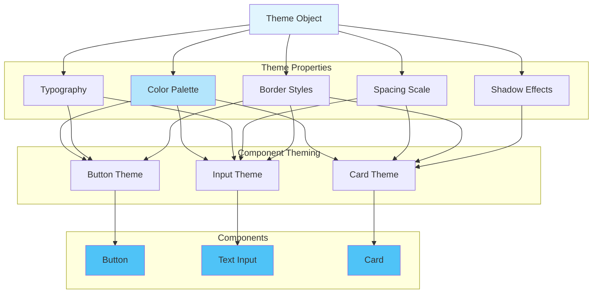

## Component Accessibility Integration

Components expose accessibility information:

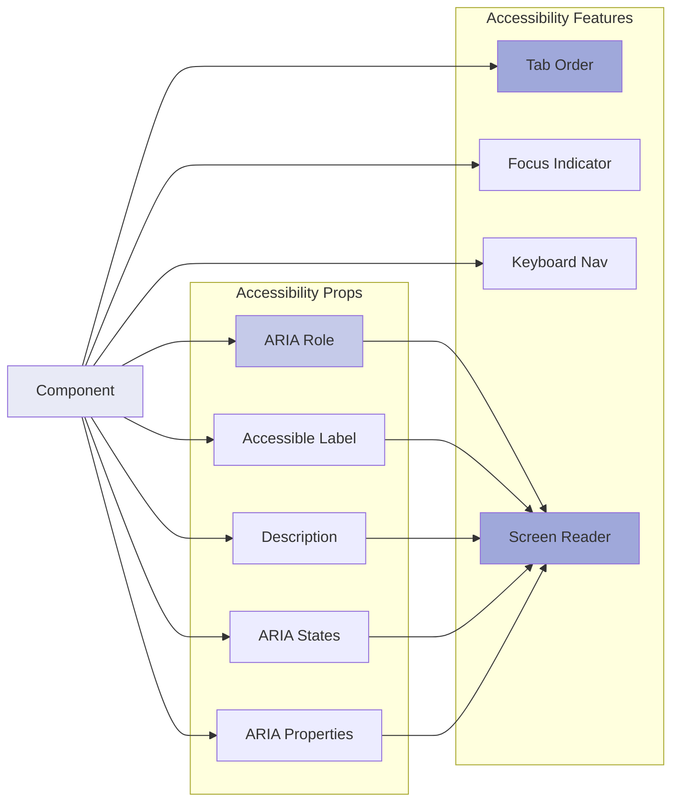

## Performance Optimizations

Components implement several performance optimizations:

### Lazy Rendering
- Components only render when visible
- Off-screen components don't generate render commands
- Visibility culling based on viewport

### Caching
- Layout calculations cached until invalidated
- Render commands cached for static content
- Theme lookups cached per component

### Batching
- Multiple component updates batched per frame
- Render commands batched before submission
- Event processing batched

### Memory Management
- Components use Arc<RwLock> for shared ownership
- Weak references prevent circular dependencies
- Resources released in component Drop impl
