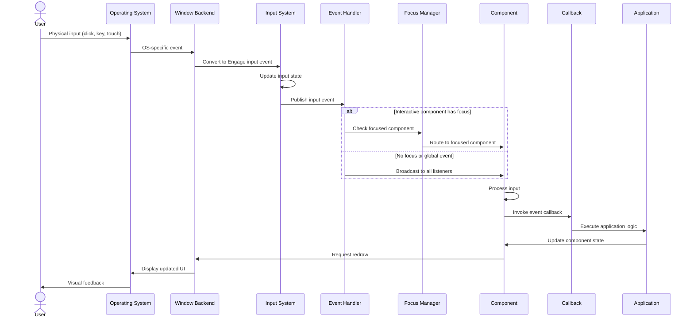
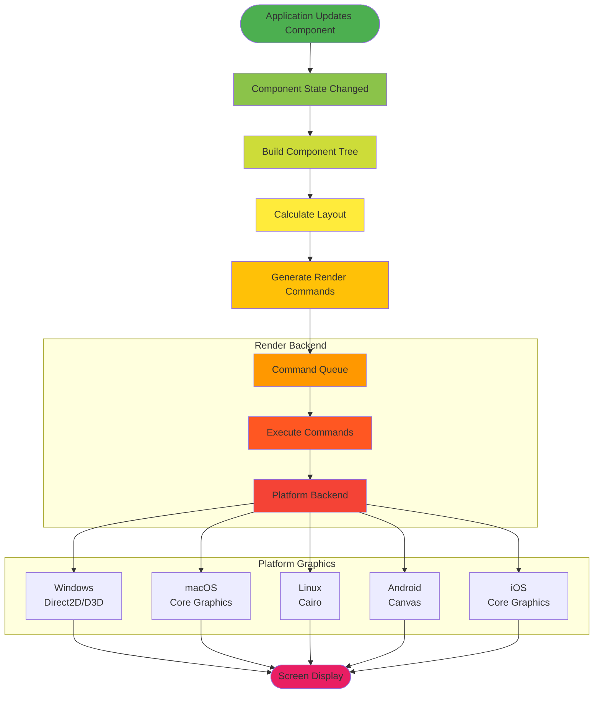
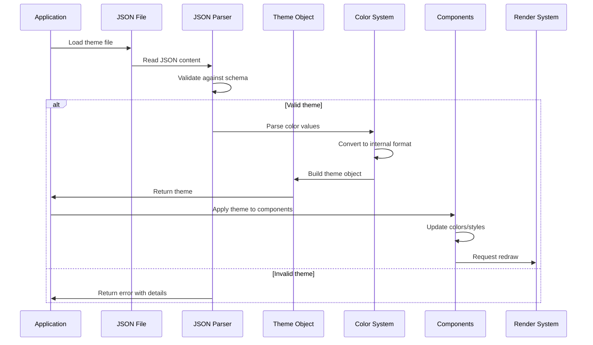
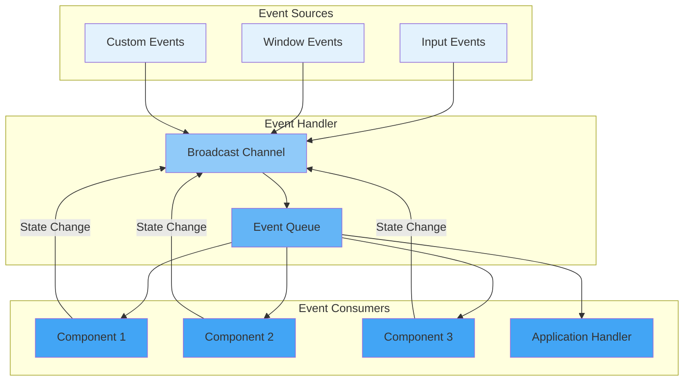
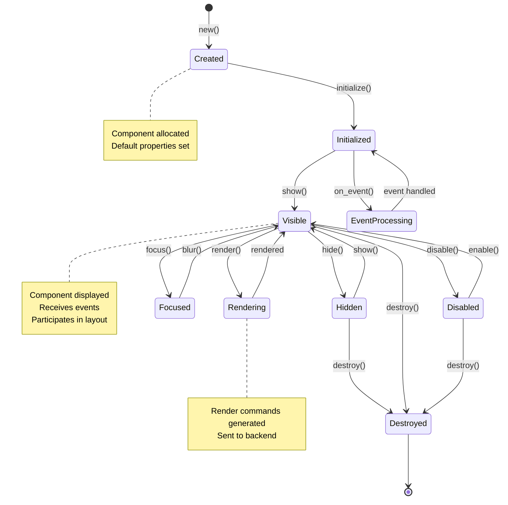
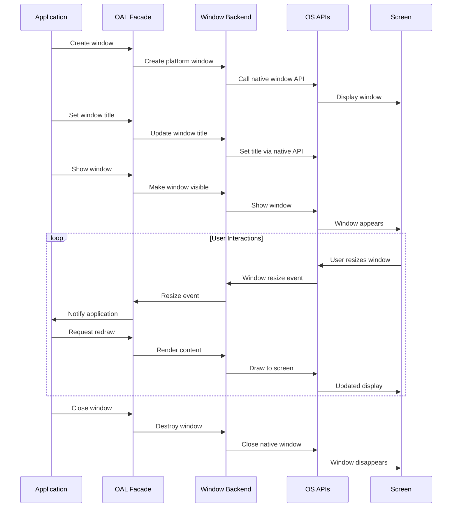
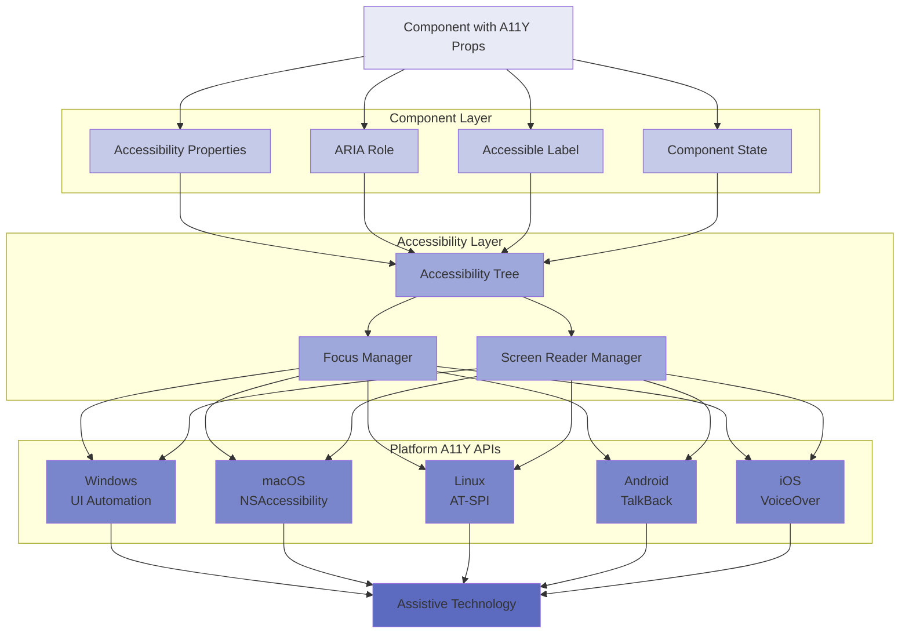
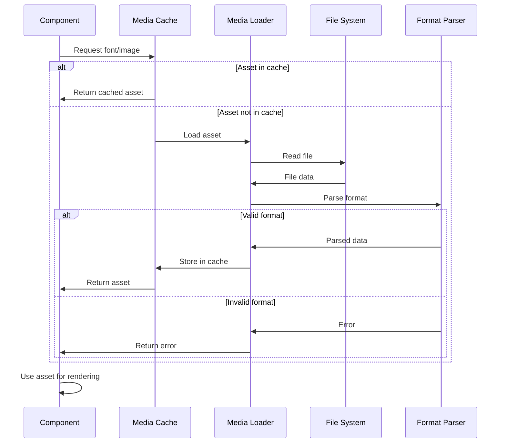
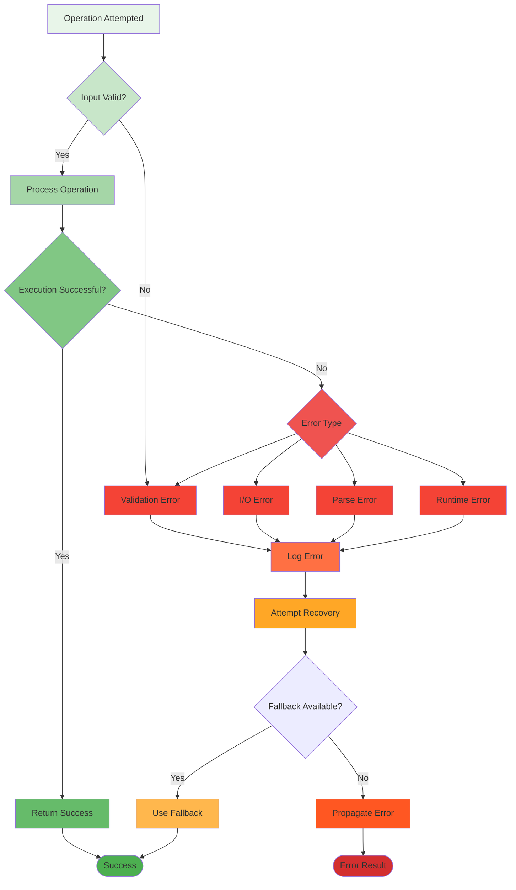

# Data Flow Architecture

## Overview

This document describes how data flows through the Engage UX system, from user input to screen output, and how components communicate with each other and the platform layer.

## User Input Flow

This diagram shows how user input (keyboard, mouse, touch) flows from the operating system to application code:



## Rendering Flow

This diagram shows how components are rendered to the screen:



## Theme Application Flow

This diagram shows how themes are loaded and applied to components:



## Event System Data Flow

Events use a publish-subscribe pattern with Tokio channels:



## Color Conversion Flow

Colors can be specified in multiple formats and are converted internally:

```mermaid
flowchart LR
    subgraph "Input Formats"
        HEX[Hex String<br/>#RRGGBB]
        RGB_ARR[RGB Array<br/>[r,g,b]]
        HSL_ARR[HSL Array<br/>[h,s,l]]
        LEGACY[Legacy Format<br/>space+components]
    end
    
    subgraph "Parsing"
        PARSE[Format Detection]
        VALIDATE[Validation]
    end
    
    subgraph "Internal Representation"
        INTERNAL[Color Struct<br/>RGBA 0.0-1.0]
    end
    
    subgraph "Output Formats"
        RGB_OUT[RGB for Rendering]
        HSL_OUT[HSL for Manipulation]
        SERIALIZE[JSON Serialization]
    end
    
    HEX --> PARSE
    RGB_ARR --> PARSE
    HSL_ARR --> PARSE
    LEGACY --> PARSE
    
    PARSE --> VALIDATE
    VALIDATE --> INTERNAL
    
    INTERNAL --> RGB_OUT
    INTERNAL --> HSL_OUT
    INTERNAL --> SERIALIZE
    
    style HEX fill:#fff3e0
    style RGB_ARR fill:#fff3e0
    style HSL_ARR fill:#fff3e0
    style LEGACY fill:#fff3e0
    style PARSE fill:#ffe0b2
    style VALIDATE fill:#ffcc80
    style INTERNAL fill:#ffb74d
    style RGB_OUT fill:#ffa726
    style HSL_OUT fill:#ffa726
    style SERIALIZE fill:#ffa726
```

## Component Lifecycle Data Flow

Components have a lifecycle from creation to destruction:



## Window Management Flow

Window operations flow through the OAL to platform-specific implementations:



## Accessibility Data Flow

Accessibility information flows from components to platform accessibility APIs:



## Font and Image Loading Flow

Media assets are loaded lazily and cached:



## Error Handling Flow

Errors are handled gracefully throughout the system:



## Performance Optimization Data Flow

The system includes several optimization strategies:

### Lazy Loading
- Fonts loaded only when first used
- Images loaded only when component becomes visible
- Platform backends initialized on demand

### Caching
- Rendered components cached when possible
- Font metrics cached
- Layout calculations cached until invalidated
- Theme colors cached after conversion

### Batching
- Render commands batched per frame
- Event processing batched
- Layout calculations batched

### Async Operations
- Long-running operations use Tokio async
- File I/O is async
- Network operations are async (future feature)

### Memory Management
- RAII ensures proper cleanup
- Reference counting (Arc) for shared data
- Weak references to prevent cycles
- Explicit drop for large resources
