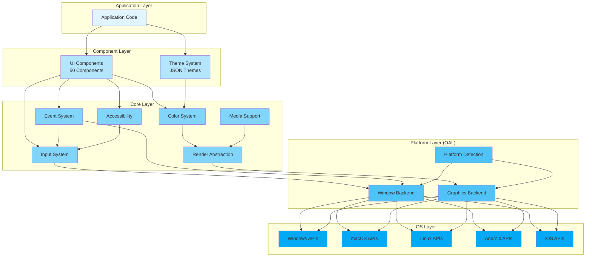
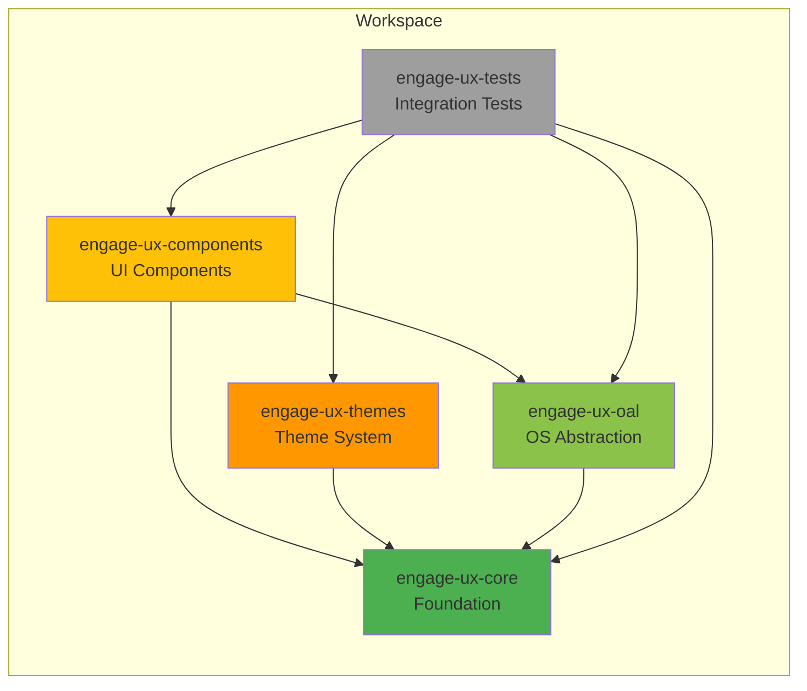
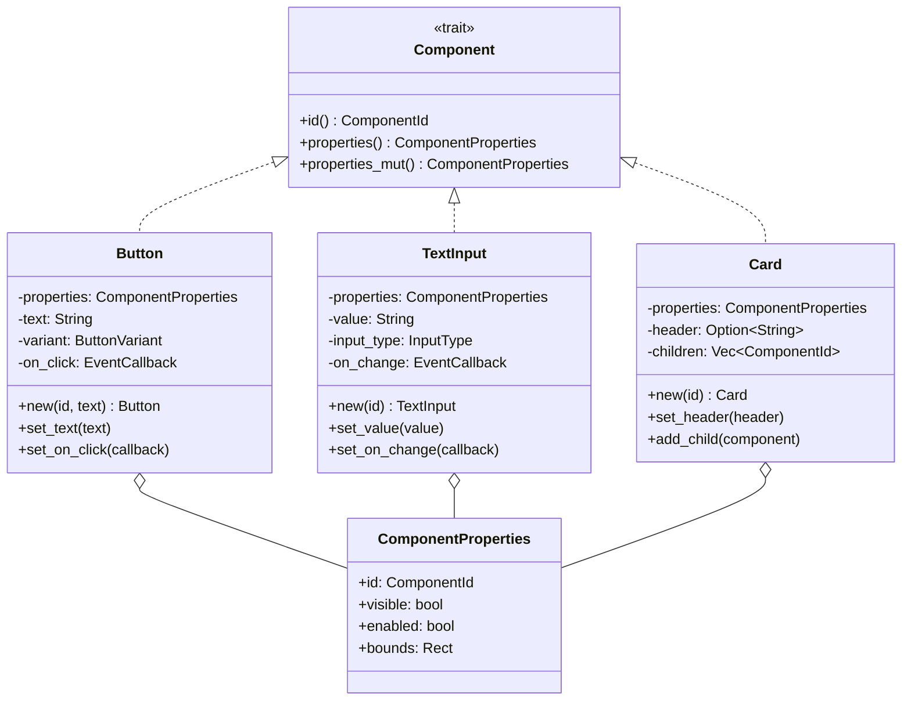
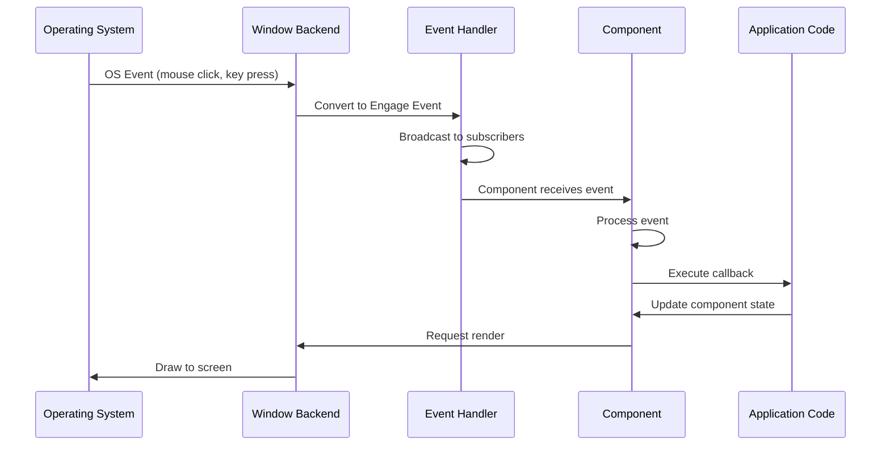
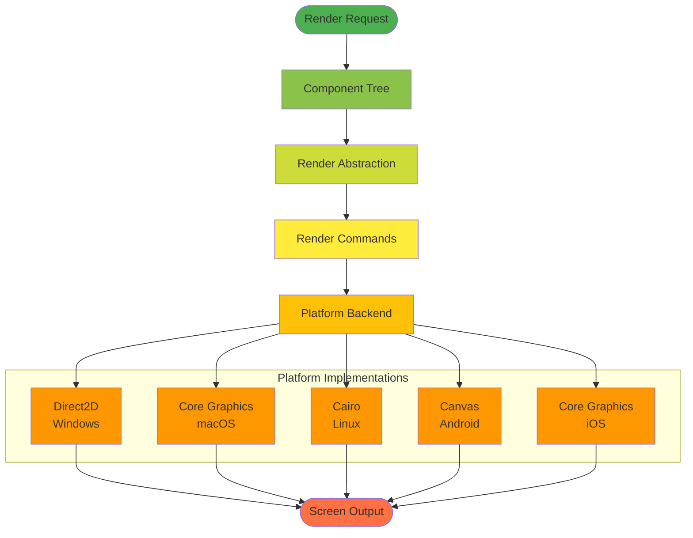
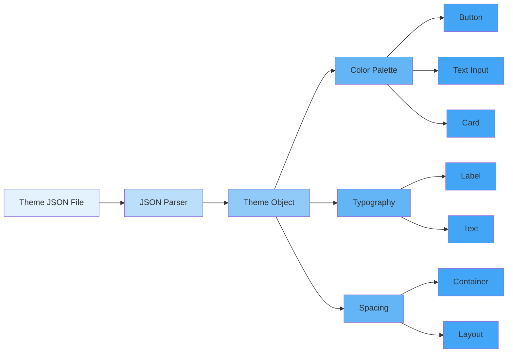
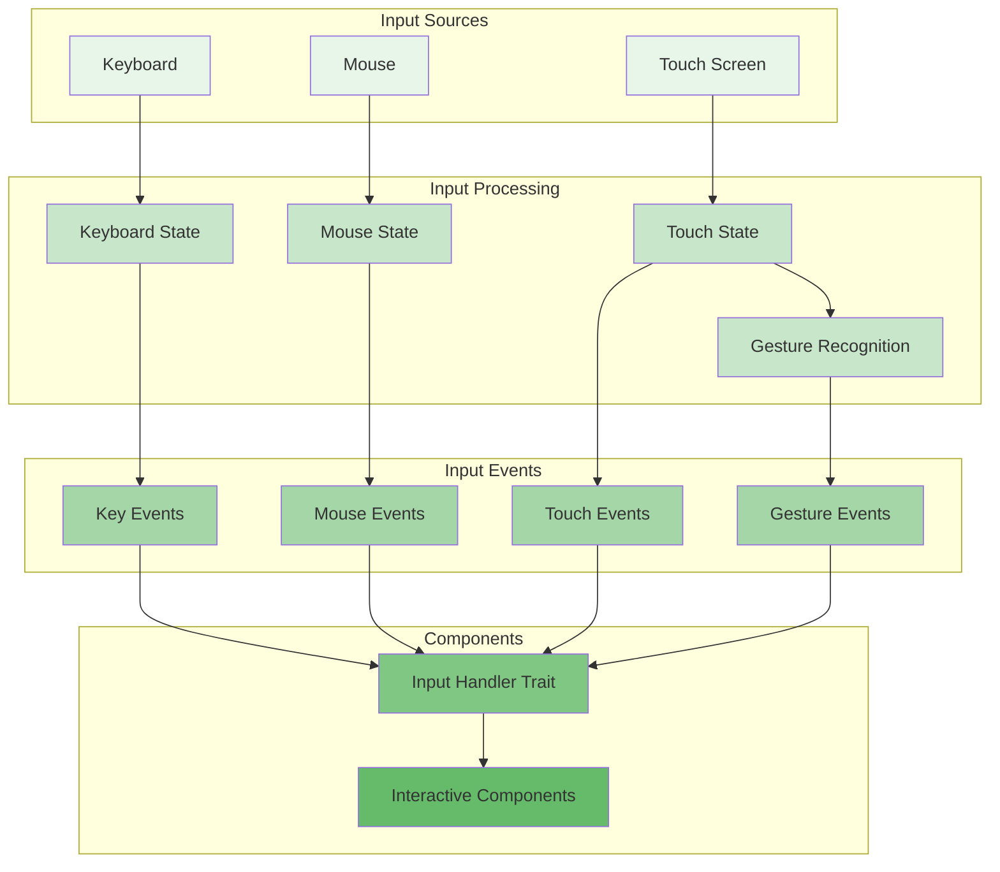
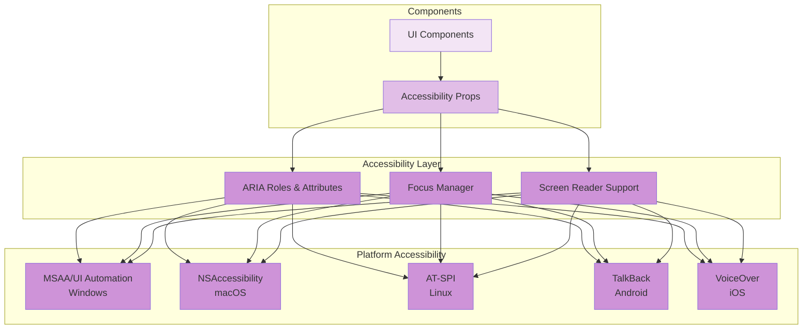

# System Architecture

## Overview

This document describes the overall system architecture of Engage UX, showing the major components, their relationships, and how data flows through the system.

## High-Level Architecture

Engage UX follows a layered architecture pattern with clear separation of concerns:

## Crate Organization

Engage UX is organized as a Cargo workspace with the following crates:

## Component Architecture

The component system follows a trait-based architecture:

## Event Flow

Events flow through the system from OS to components:

## Rendering Pipeline

The rendering pipeline abstracts platform-specific graphics:

## Theme System Architecture

Themes are loaded from JSON and applied to components:

## Input System Architecture

Input is processed through a unified handler system:

## Accessibility Architecture

Accessibility is integrated throughout the component system:

## Design Patterns Used

### 1. Trait-Based Architecture
- `Component` trait for all UI elements
- `RenderBackend` trait for platform-specific rendering
- `WindowBackend` trait for platform-specific windows
- `InputHandler` trait for input processing

### 2. Factory Pattern
- Platform-specific backend creation
- Component creation with builders

### 3. Observer Pattern
- Event system with broadcast channels
- Component callbacks for state changes

### 4. Strategy Pattern
- Different rendering strategies per platform
- Different window management strategies per platform

### 5. Adapter Pattern
- OS APIs adapted to unified interface
- Color format conversions

### 6. Command Pattern
- Render commands for graphics operations
- Event commands for user interactions

## Thread Safety

Engage UX is designed to be fully thread-safe:

- **Components**: Wrapped in `Arc<RwLock<T>>` for concurrent access
- **Events**: Tokio broadcast channels for async event distribution
- **State**: Atomic types and locks for shared state
- **Rendering**: Render commands queued and executed on render thread

## Performance Considerations

- **Lazy Loading**: Images and fonts loaded on demand
- **Caching**: Rendered elements cached where appropriate
- **Async Operations**: Long-running tasks use async/await
- **Memory Management**: RAII ensures proper cleanup
- **Minimal Allocations**: Reduce heap allocations in hot paths

## Security Architecture

- **Memory Safety**: `#![forbid(unsafe_code)]` in all crates
- **Input Validation**: All external input validated
- **SVG Security**: Scripts and external resources blocked
- **Dependency Vetting**: Only maintained, secure dependencies
- **Sandboxing**: Platform-specific sandboxing where available
